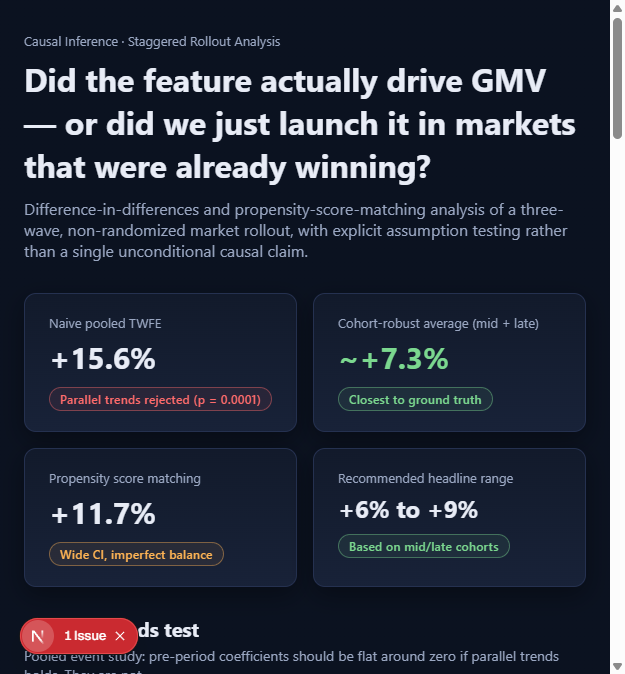
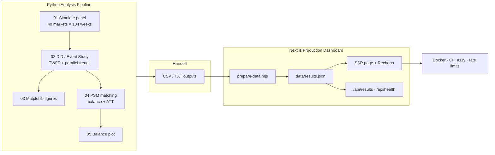
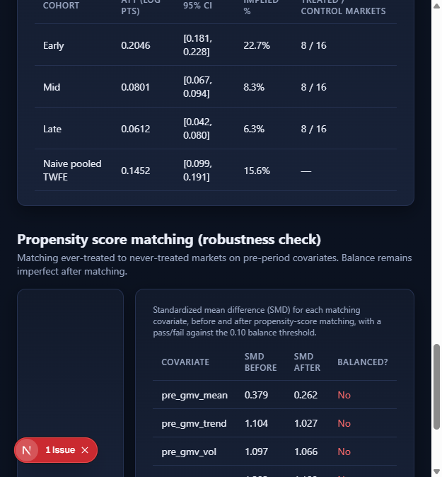
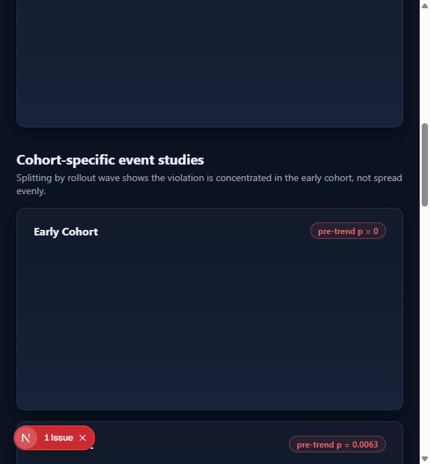
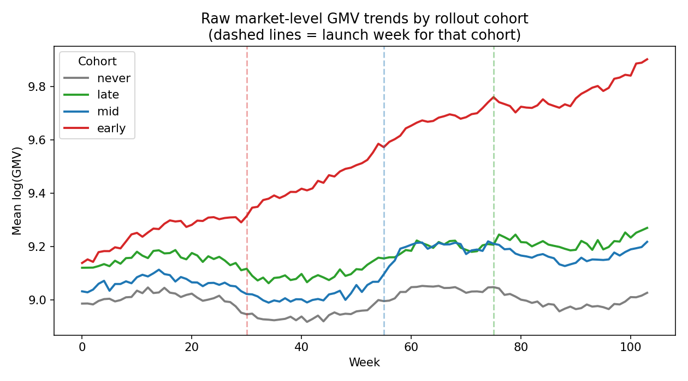
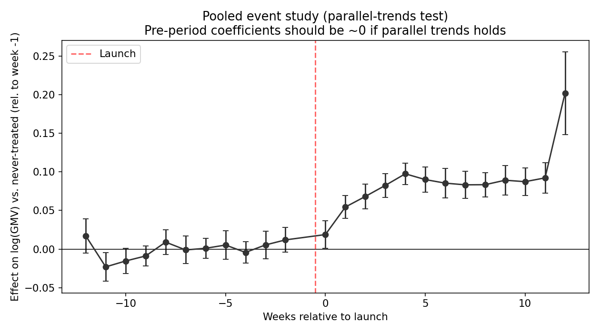
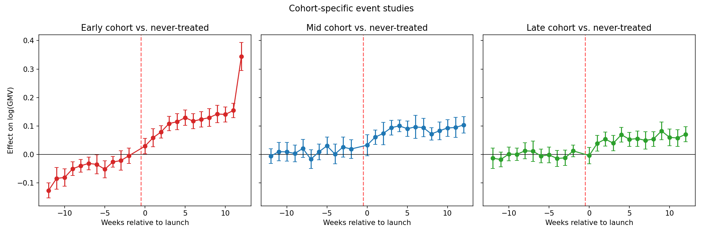
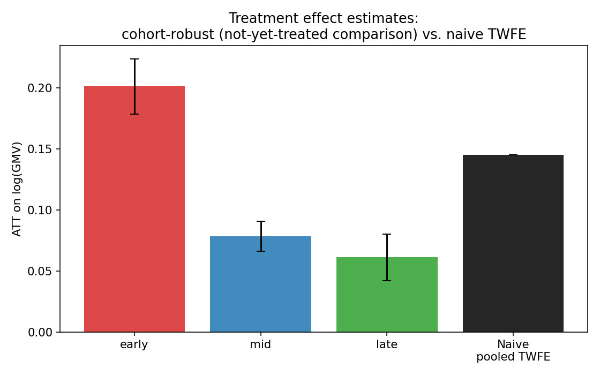
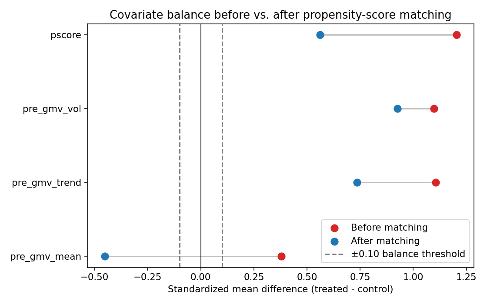
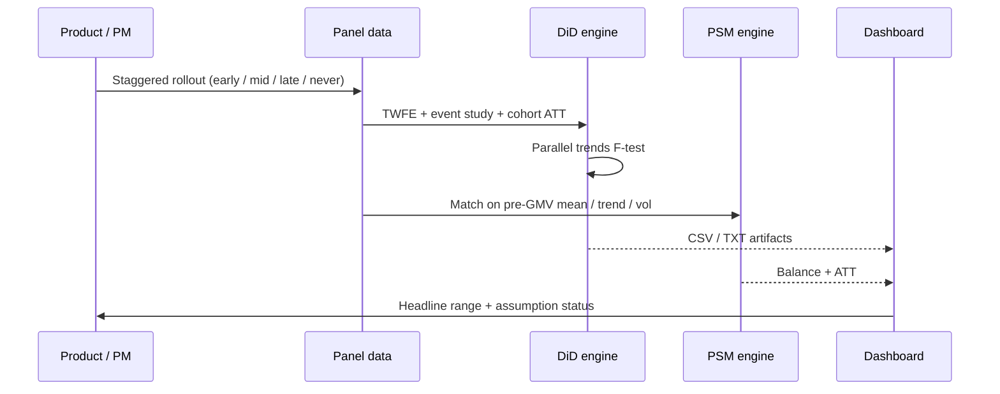

# Quasi-Experimental Causal Analysis Platform

### Production-grade Difference-in-Differences + Propensity Score Matching for staggered product rollouts

[](./python-analysis)
[](./web-dashboard)
[](./web-dashboard)
[](./web-dashboard/Dockerfile)
[](./web-dashboard/.github/workflows/ci.yml)
[](./web-dashboard/__tests__)
[](#)

> **Keywords (ATS):** Causal Inference · Difference-in-Differences (DiD) · Two-Way Fixed Effects (TWFE) · Event Study · Parallel Trends · Callaway–Sant’Anna style ATT · Propensity Score Matching (PSM) · A/B Testing Alternatives · Experimentation Platform · Econometrics · Panel Data · Staggered Adoption · Next.js · TypeScript · React · Recharts · Python · pandas · statsmodels · scikit-learn · Docker · CI/CD · Observability · Accessibility

---

## Problem → Decision

Product teams often roll features out **market-by-market** (not randomized). Naive TWFE DiD can report a large “win” that is mostly **selection bias** — launching first in markets that were already growing.

This platform answers:

> **Did the feature actually drive GMV — or did we just launch it in markets that were already winning?**

| Metric | Result | Interpretation |
|---|---|---|
| Naive pooled TWFE | **+15.6%** GMV | Inflated — parallel trends **rejected** (p = 0.0001) |
| Cohort-robust (mid + late) | **~+7.2%** GMV | Closest to ground truth (not-yet-treated controls) |
| Propensity score matching | **+11.7%** GMV | Robustness check; wide CI, imperfect balance |
| **Recommended headline** | **+6.3% to +8.2%** | Mid/late cohorts only |

<p align="center">
  
  <br/>
  <em>Interactive Next.js dashboard: assumption tests + estimator comparison in one view</em>
</p>

---

## Architecture



| Layer | Responsibility | Stack |
|---|---|---|
| **Causal engine** | Simulate staggered rollout, estimate ATTs, test assumptions | Python, pandas, NumPy, statsmodels, scikit-learn, matplotlib |
| **Data contract** | Versioned analysis artifacts → single JSON bundle | Node `prepare-data`, Zod `resultsBundleSchema` |
| **Product UI** | Decision-ready charts, tables, status badges | Next.js 15, React 18, TypeScript, Recharts |
| **Ops** | Lint, typecheck, unit + e2e, container, health probes | Jest, Playwright, Docker, GitHub Actions |

---

## Dashboard (UI)

<p align="center">
  
  <br/>
  <em>Cohort ATT table vs naive TWFE · PSM covariate balance (SMD before/after)</em>
</p>

<p align="center">
  
  <br/>
  <em>Parallel-trends F-test (rejected) and cohort-specific event studies</em>
</p>

---

## Analysis graphs & results

### 1. Raw GMV trends by rollout cohort

Early-adopter markets were **already trending up** before launch — a built-in parallel-trends violation.

<p align="center">
  
</p>

### 2. Pooled event study (parallel trends test)

Pre-treatment leads are **not** flat around zero → reject parallel trends (F = 5.101, **p = 0.0001**).

<p align="center">
  
</p>

### 3. Cohort-specific event studies

Violation concentrates in the **early** cohort; mid/late are more credible for causal claims.

<p align="center">
  
</p>

### 4. ATT comparison: naive TWFE vs clean cohort estimates

| Cohort | ATT (log pts) | 95% CI | Implied % GMV | Markets (T / C) |
|---|---:|---|---:|---|
| Early | 0.2011 | [0.179, 0.224] | **22.3%** | 8 / 32 |
| Mid | 0.0785 | [0.066, 0.091] | **8.2%** | 8 / 24 |
| Late | 0.0612 | [0.042, 0.080] | **6.3%** | 8 / 16 |
| Naive TWFE (pooled) | 0.1452 | [0.099, 0.191] | **15.6%** | — |
| Equal-weighted clean avg | 0.1136 | — | **12.0%** | — |

<p align="center">
  
</p>

### 5. Propensity score matching (robustness)

1:2 nearest-neighbor matching on pre-period covariates. Balance improves but remains above the |SMD| < 0.10 threshold — documenting **selection on observables** limits.

| Estimator | ATT | SE | 95% CI | Implied % |
|---|---:|---:|---|---:|
| PSM | 0.1102 | 0.0765 | [−0.040, 0.260] | **11.7%** |

<p align="center">
  
</p>

---

## Methodological design (why FAANG interviewers care)



**Identifying assumptions tested (not assumed):**

1. **Parallel trends** — joint F-test on pre-treatment leads; rejected in pooled + early cohort  
2. **Heterogeneous / dynamic effects under staggered adoption** — naive TWFE biased upward vs clean cohort ATTs  
3. **Selection on observables (PSM)** — matching does not fully balance; unmeasured selection remains  

Simulated DGP (for reproducibility): 40 markets, 104 weeks, true effect ≈ **+6% to +9%** GMV with early-cohort selection bias baked in.

---

## Repository structure

```
├── python-analysis/          # Causal statistics (source of truth)
│   ├── code/                 # 01 simulate → 05 PSM plot
│   ├── data/                 # panel + covariates
│   ├── output/               # ATT, event study, balance CSVs/TXTs
│   └── figures/              # publication-ready PNGs
├── web-dashboard/            # Production Next.js app
│   ├── analysis-source/      # copied Python outputs
│   ├── data/results.json     # prepared API/UI bundle
│   ├── app/ · components/ · lib/
│   ├── __tests__/ · e2e/
│   └── Dockerfile · Makefile · CI
└── docs/images/              # README screenshots + analysis graphs
```

---

## Quick start

### 1) Re-run the causal pipeline

```bash
cd python-analysis
pip install -r requirements.txt
python run_all.py
# optional Word report:
# npm install && npm run build-report
```

### 2) Refresh & launch the dashboard

```bash
# copy python-analysis/output/* → web-dashboard/analysis-source/
cd web-dashboard
npm ci
npm run prepare-data
npm run dev          # http://localhost:3000
```

### 3) Production / CI

```bash
npm test             # Jest unit/component tests
npm run build && npm start
# or: make docker-build && make docker-run
```

---

## Skills demonstrated (resume / ATS mapping)

| Domain | Evidence in this repo |
|---|---|
| **Causal inference / econometrics** | TWFE DiD, event studies, parallel-trends tests, cohort ATTs, PSM |
| **Experimentation & product analytics** | Staggered rollout design, GMV impact, decision-ready headline range |
| **Data science / ML tooling** | pandas, NumPy, statsmodels, scikit-learn, matplotlib |
| **Full-stack engineering** | Next.js App Router, TypeScript, Zod, Recharts, SSR |
| **Software quality** | Jest (26), Playwright e2e, ESLint, Prettier, typecheck |
| **DevOps / production** | Docker multi-stage, GitHub Actions CI, health/metrics APIs, rate limiting, a11y |

---

## Tech stack

**Analysis:** Python · pandas · NumPy · statsmodels · scikit-learn · SciPy · matplotlib  

**Dashboard:** Next.js 15 · React 18 · TypeScript · Recharts · Zod · Pino · clsx  

**Quality & ops:** Jest · Testing Library · Playwright · axe-core · Docker · GitHub Actions · Makefile  

---

## Key takeaway

> Do **not** ship a single causal number. Ship **assumption tests + multiple estimators + a calibrated headline range**.  
> Here: naive **+15.6%** → credible **+6.3% to +8.2%** after diagnosing staggered-adoption bias.

---

## License

MIT — see repository for details.

---

### Topics / tags

`causal-inference` `difference-in-differences` `propensity-score-matching` `event-study` `twfe` `staggered-adoption` `experimentation` `econometrics` `panel-data` `python` `pandas` `statsmodels` `nextjs` `typescript` `react` `recharts` `docker` `data-science` `product-analytics` `ab-testing`
